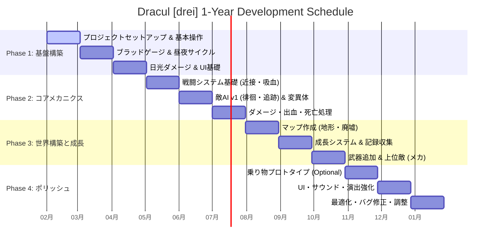

# Dracul [drei] 開発スケジュール (ガントチャート)

`DevelopmentPlan.md` に基づく1年間の開発工程表です。

## 各フェーズ詳細

### Phase 1: Foundation (Months 1-3)
*   **Month 1:** プロジェクト作成、キャラコン導入、グレイボクシング。
*   **Month 2:** 飢餓システム（ブラッドゲージ）、時間経過システム。
*   **Month 3:** 環境ダメージ（日光）、HUD実装。

### Phase 2: Core Mechanics (Months 4-6)
*   **Month 4:** 攻撃モーション、ヒットストップ、吸血アクション。
*   **Month 5:** NavMesh導入、ステートマシンAI、雑魚敵実装。
*   **Month 6:** ヘルス管理、状態異常（出血）、ゲームオーバー処理。

### Phase 3: World & Progression (Months 7-9)
*   **Month 7:** Terrain作成、アセット配置、レベルデザイン。
*   **Month 8:** インタラクトUI、ステータス強化ロジック、スキル解放。
*   **Month 9:** 銃撃戦、近接コンボ、中ボス級AI。

### Phase 4: Polish (Months 10-12)
*   **Month 10:** （余裕があれば）車両挙動の実装。
*   **Month 11:** メニュー画面、SE/BGM実装、ポストプロセス調整。
*   **Month 12:** プロファイラーによる負荷軽減、デバッグ、難易度調整。
